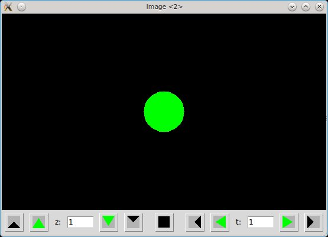

This pair of blog posts is designed to walk users through the process of creating GUIs in Julia. It's well-known that plotting in Julia is still evolving, and one might therefore expect that it might be premature to build GUIs with Julia. My own recent experience has taught me that this expectation is wrong: compared with building GUIs in Matlab (my only previous GUI-writing experience), Julia already offers a number of quite compelling advantages. We'll see some of these advantages on display below.

We'll go through the highlights needed to create an image viewer GUI. Before getting into how to write this GUI, first let's play with it to get a sense for how it works. You'll need the `ImageView` package:

```
Pkg.add("ImageView")
```
It's worth pointing out that this package is expected to evolve over time; however, if things have changed from what's described in this blog, try checking out the "blog" branch directly from the [repository](https://github.com/timholy/ImageView.jl).

First let's try it with a photograph. Load one this way:
```
using Images
using ImageView
img = imread("my_photo.jpg")
```
Any typical image format should be fine, it doesn't have to be a jpg. Now display the image this way:
```
display(img; pixelspacing = [1,1])
```
The basic command to view the image is `display`. The optional `pixelspacing` input tells `display` that this image has a fixed aspect ratio, and that this needs to be honored when displaying the image. (Alternatively, you could set `img["pixelspacing"] = [1,1]` and then you wouldn't have to tell this to the `display` function.)

You should get a window with your image. OK, nice. But we can start to have some fun if we resize the window, which causes the image to get bigger or smaller. You'll also note that sometimes it has a black perimeter; that's because we've specified the aspect ratio through the `pixelspacing` input, and when the window doesn't have the same aspect ratio as the image you'll have a perimeter either horizontally or vertically. Try it without specifying `pixelspacing`, and you'll see that the image stretches to fill the window, but it looks distorted.

Next, click and drag somewhere inside the image. You'll see the typical rubberband selection, and once you let go the image display will zoom in on the selected region. Again, the aspect ratio of the display is preserved. Double-clicking on the image restores the display to full size.

If you have a wheel mouse, zoom in again and scroll the wheel, which should cause the image to pan vertically. If you scroll while holding down Shift, it pans horizontally; hold down Ctrl and you affect the zoom setting. Note as you zoom via the mouse, the zoom stays focused around the mouse pointer location, making it easy to zoom in on some small feature simply by pointing your mouse at it and then Ctrl-scrolling.

Long-time users of Matlab may note a number of nice features about this behavior:

- The resizing and panning is much smoother than Matlab's
- Matlab doesn't expose modifier keys in conjunction with the wheel mouse, making it difficult to implement this degree of interactivity
- In Matlab, zooming with the wheel mouse is always centered on the middle of the display, requiring you to alternate between zooming and panning to magnify a particular small region of your image or plot.

These already give a taste of some of the features we can achieve quite easily in Julia.

However, there's more to this GUI than meets the eye. You can display the image upside-down with
```
display(img; pixelspacing = [1,1], flipy=true)
```
or switch the `x` and `y` axes with
```
display(img; pixelspacing = [1,1], xy=["y","x"])
```
To experience the full functionality, you'll need a "4D  image," a movie (time sequence) of 3D images. If you don't happen to have one lying around, you can create one via `include("test/test4d.jl")`, where `test` means the test directory in `ImageView`. This creates a solid cone that changes color over time. Load this file, then type `display(img)`. You should see something like this:



The green circle is a "slice" from the cone. At the bottom you'll see our current location, `z=1` and `t=1`, which corresponds to the base of the cone and the beginning of the movie. Click the upward-pointing green arrow, and you'll "pan" through the cone in the `z` dimension, making the circle smaller. You can go back to the base with the downward-pointing green arrow, or step frame-by-frame with the black arrows. Clicking the "play forward" button changes the color through gray to magenta. The black square is a stop button; for a small movie like this, you have to be quick to press it! You can, of course, type a particular `z`, `t` location into the entry boxes.

If you have a wheel mouse, Alt-scroll changes the time, and Ctrl-Alt-scroll changes the z-slice.

You might want to see a different set of slices from the 4d image. Just try this:
```
display(img; pixelspacing = [1,1], xy=["x","z"])
```
Initially you'll see nothing, but that's because this edge of the image is black. Type 151 into the `y:` entry box (note its name has changed) and hit enter; you'll now see the cone from the side.

This GUI is also useful for "plain movies" (2d images with time), in which case the `z` controls will be omitted and it will behave largely as a typical movie-player. Likewise, the `t` controls will be omitted for 3d images lacking a temporal component, making this a nice viewer for MRI scans.

This completes our tour of the features of this GUI. Now let's go through a few of the highlights needed to create it. We'll tackle this in pieces; not only will this make it easier to learn, but it also illustrates how to build re-useable components. Let's start with the navigation frame.

## First steps: the navigation frame

First, let me acknowledge that this GUI is built on the work of many people who have contributed to Julia's Cairo and Tk packages. For this step, we'll make particular use of John Verzani's contribution of a huge set of convenience wrappers for most of Tk's widget functionality. John wrote up a nice set of [examples](https://github.com/JuliaLang/Tk.jl/tree/master/examples) that demonstrate many of the things you can do with it; this first installment is essentially just a "longer" example, and won't surprise anyone who has read his documentation.

Let's create a couple of types to hold the data we'll need. We need a type that stores "GUI state," which here consists of the currently-viewed location in the image and whether one of the "play" buttons is currently active:
```
type NavigationState
    # Dimensions:
    zmax::Int          # number of frames in z, set to 1 if only 2 spatial dims
    tmax::Int          # number of frames in t, set to 1 if only a single image
    z::Int             # current position in z-stack
    t::Int             # current moment in time
    isplaying::Bool    # are we in continuous playback?
end
```
Next, let's create a type to hold "handles" to all the widgets:
```
type NavigationControls
    stepup                            # buttons...
    stepdown
    playup
    playdown
    stepback
    stepfwd
    playback
    playfwd
    stop
    editz                             # edit boxes
    editt
    textz                             # static text (information)
    textt
end
NavigationControls() = NavigationControls(nothing, nothing, nothing, nothing, nothing, nothing, nothing, nothing, nothing, nothing, nothing, nothing, nothing)
```
It might not be strictly necessary to hold handles to all the widgets (you could do everything with callbacks), but having them available is convenient. For example, if you don't like the icons I created, you can easily initialize the GUI and replace, using the handles, the icons with something better.

We'll talk about initialization later; for now, assume that we have a variable `state` of type `NavigationState` that holds the current position in the (possibly) 4D image, and `ctrls` which contains a fully-initialized set of widget handles.

Each button needs a callback function to be executed when it is clicked. Let's go through the functions for controlling `t`. First there is a general utility not tied to any button, but it affects many of the controls:
```
function updatet(ctrls, state)
    set_value(ctrls.editt, string(state.t))
    enableback = state.t > 1
    set_enabled(ctrls.stepback, enableback)
    set_enabled(ctrls.playback, enableback)
    enablefwd = state.t < state.tmax
    set_enabled(ctrls.stepfwd, enablefwd)
    set_enabled(ctrls.playfwd, enablefwd)
end
```
The first line displays the value of `state.t` in the entry box. The remainder control which of the `t` navigation buttons are enabled (if `t==1`, we can't go any earlier in the movie, so we gray out the backwards buttons).

A second utility function modifies `state.t`:
```
function incrementt(inc, ctrls, state, showframe)
    state.t += inc
    updatet(ctrls, state)
    showframe(state)
end
```
Note the call to `updatet` described above. The new part of this is the `showframe` function, whose job it is to display the image frame (or any other visual information) to the user. Typically, the actual `showframe` function will need additional information such as where to render the image, but you can provide this information using anonymous functions. We'll see how that works in the next installment; below we'll just create a simple "stub" function.

Now we get to the true callbacks, which are bound to the step, play, and entry widgets:
```
function stept(inc, ctrls, state, showframe)
    if 1 <= state.t+inc <= state.tmax
        incrementt(inc, ctrls, state, showframe)
    end
end

function playt(inc, ctrls, state, showframe)
    state.isplaying = true
    while 1 <= state.t+inc <= state.tmax && state.isplaying
        tcl_doevent()    # allow the stop button to take effect
        incrementt(inc, ctrls, state, showframe)
    end
    state.isplaying = false
end

function sett(ctrls,state,showframe)
    tstr = get_value(ctrls.editt)
    try
        val = int(tstr)
        state.t = val
        updatet(ctrls, state)
        showframe(state)
    catch
        updatet(ctrls, state)
    end
end
```
`stept()` increments the `t` frame by the specified amount (typically 1 or -1), while `playt()` runs a loop until it reaches the edge or `state.isplaying` gets set to false. A key point here is the call to `tcl_doevent()`, which allows Tk to interrupt the execution of the loop to handle user interaction (in this case, clicking the stop button). Finally, `sett` runs when the user types an entry into the edit box; if the user types in nonsense like "foo", it will gracefully reset it to the current position.

There's a complementary set of these functions for the `z` controls.

These callbacks implement the functionality of this "navigation" GUI. The other main task is initialization. We won't cover this in gory detail (you are invited to browse the code), but let's hit a few highlights.

#### Creating the buttons

You can use image files (e.g., .png files) for your icons, but the ones here are created programmatically. One specifies two colors, the "foreground" and "background", as strings. One also needs the `data` array (of type `Bool`) for the pixels that should be colored by the foreground color, and false for the ones to be set to the background. There's also the `mask` array, which can prevent the `data` array from taking effect in any pixels marked as false.

Given suitable `data` and `mask` arrays (here we just set the mask to `trues`), and color strings, we create the icon and assign it to a button like this:
```
icon = Tk.image(data, mask, "gray70", "black")  # background=gray70, foreground=black
ctrls.stop = Button(f, icon)
```
Here `f` is the "parent frame" that the navigation controller will be rendered in. We'll create one of these below. 

#### Assigning callbacks to widgets

The `stop` and `play backwards` buttons look like this:
```
tk_bind(ctrls.stop, "command", path -> state.isplaying = false)
tk_bind(ctrls.playback, "command", path -> playt(-1, ctrls, state, showframe)
```
The `path` input is generated by Tk/Tcl, but we don't have to use it. In particular, we use anonymous functions to pass the arguments relavant to this particular GUI instantiation. You can see that the only action of the stop button is to set `state.isplaying` to `false`; this value is tested in the `playt` callback function (note the two share `ctrls` as data, so one function can see updates written by the other).

#### Placing the buttons in the frame

For this, we use Tk's `grid` layout engine. Here our needs are quite simple, but I recommend that you read the [excellent](http://www.tkdocs.com/tutorial/concepts.html#geometry) [tutorial](http://www.tkdocs.com/tutorial/grid.html) on this topic. `grid` provides a great deal of functionality missing in Matlab, and in particular allows flexible and polished GUI behavior when resizing the window.

We position the stop button this way:
```
grid(ctrls.stop, 1, stopindex, {:padx => 3*pad, :pady => pad})
```
After the handle for the button itself, the next two inputs determine the row, column position of the widget. Here the column position is set using a variable whose value will depend on whether the z controls are present.  The `pad` settings just apply a bit of padding around the button.

### Putting it all together and testing it out

We'll place the navigation controls inside a Tk frame. Let's create one from the command line:
```
using Tk
w = Toplevel()
f = Frame(w); pack(f, {:expand=>true, :fill=>"both"})
```
We need a `showframe` callback; for now let's create a very simple one that will help in testing:
```
showframe = x -> (println("showframe z=", x.z, ", t=", x.t); for i = 1:10^8; end)
```
I included a "busywait" loop to slow it down, and thereby allow us to test that hitting the stop button interrupts the playback. (It seems that `sleep` doesn't work inside callbacks.)

Next, load the GUI code (`include("navigation.jl"); using Navigation`) and create the `NavigationState` and `NavigationControls` objects:
```
ctrls = NavigationControls()
state = NavigationState(40,1000,2,5,false)
```
Here we've set up a fake movie with 40 image slices in `z`, and 1000 image stacks in `t`. 
Finally, we initialize the widgets:
```
init_navigation!(f, ctrls, state, showframe)
```
Now when you click on buttons, or change the text in the entry boxes, you'll see the GUI in action. You can tell from the command line output, generated by `showframe`, what's happening internally.

Hopefully this demonstrates another nice feature of developing GUIs in Julia: it's straightforward to build re-usable components. This navigation frame can be added as an element to any window, and the grid layout manager takes care of the rest. All you need to do is to include `navigation.jl` into your module, and you can make use of it with just a few lines of code.

Not too hard, right? The next step is to render the image, which brings us into the domain of Cairo.
