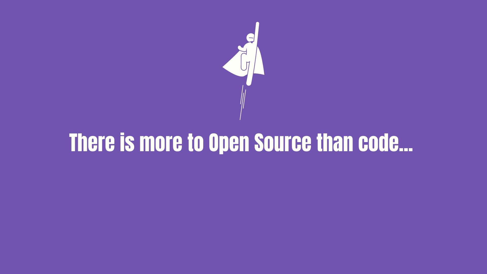

# Julia Ecosystem Contributor's Guide

Welcome to the Julia Ecosystem Contributor’s Guide and to the community! 

The purpose of this guide is **to help you get started** contributing to the Julia ecosystem. It contains information on the [benefits of becoming a Julia contributor](#why-contribute-to-the-julia-ecosystem) and the [tools](#tools) you need to get started. Also, you can find the different [contribution pathways](#contribution-pathways) that you can take and how to get [help](#get-help) from the community.

We **welcome** both **technical** and **nontechnical** contributions. Whether you are a **beginner** or a **seasoned developer**, you can always find a way to contribute to the Julia Ecosystem. 

## Why contribute to the Julia Ecosystem?

You can make a difference to one of the most quickly growing languages and the future of open-source software as a whole. Open source projects rely on contributions from volunteers. Contributions enable both the project and volunteers to grow and develop. No matter how you contribute to the Julia ecosystem, it will be a great experience for you.

Contributing to the Julia ecosystem brings the following benefits:

* Become a member of a community that’s excited about open source and sharing knowledge.
* Build a track record of public contributions which will help build your career.
* Build confidence with Julia.
* Gain visibility for your package.
* Help others level up their Julia skills.

## Tools
Before you start contributing to the Julia ecosystem, you need the following tools:

* **Julia:** For more information on how to install Julia, see [Download Julia](https://julialang.org/downloads/).
* **IDE:** You can set one of the following IDEs as well as their extensions for developing in Julia:
   * [Julia for Visual Studio Code](https://www.julia-vscode.org/)
   * [IJulia](https://github.com/JuliaLang/IJulia.jl)
   * [Pluto.jl](https://github.com/fonsp/Pluto.jl)
   * [Julia-vim](https://github.com/JuliaEditorSupport/julia-vim)
   * [Emacs major mode for the Julia programming language](https://github.com/JuliaEditorSupport/julia-emacs)
   * [Julia language support for Notepad++](https://github.com/JuliaEditorSupport/julia-NotepadPlusPlus)
* **Knowledge of Git and how to create a pull request:** For more information on getting started with Git, see [Making a first Julia pull request](https://kshyatt.github.io/post/firstjuliapr/).

## Contribution Pathways

Your **first step** is to identify how you want to start contributing to the Julia ecosystem. For example, you can start by writing a blog post about how you used Julia to solve a problem. Then, you can create a new package or improve one that you have used. You can take multiple paths, some of which might cross. 

If you are a **complete beginner** to the Julia language or programming in general, then you can consider going through any of the resources that the community has created to [help you get started](https://julialang.org/learning/). 

We suggest the following paths as a starting point in your contribution journey:

* **Build:** You can write code or documentation:
   * **Code**
     * [Contribute to core Julia](https://github.com/JuliaLang/julia/blob/master/CONTRIBUTING.md#submitting-contributions).
       * Find an [open issue](https://github.com/JuliaLang/julia/issues).
       * Report a [security issue](https://github.com/JuliaLang/julia/security/policy).
     * [Contribute to an existing package](https://julialang.org/contribute/opportunities/).
       * Find a [help wanted](https://github.com/issues?q=is%3Aopen+is%3Aissue+language%3AJulia+label%3A%22help+wanted%22) issue. 
       * Find a [good first](https://github.com/issues?q=is%3Aopen+is%3Aissue+language%3AJulia+label%3A%22good+first+issue%22+) issue.
     * [Develop a new package](). kjdfsklfjdakflala
     * [Review a package submitted](https://github.com/JuliaRegistries/General/blob/master/CONTRIBUTING.md) to the [Julia Registry](https://github.com/JuliaRegistries/General).
     * File a bug report.
     * [Write tests](https://kshyatt.github.io/post/firstjuliapr/).
     * Make a feature request.
   * **Documentation** 
     * Create new documents: Write new sections of existing documentation, docstrings, and tutorials.
     * Improve existing documents: Update outdated documentation, fix typos and broken links.
* **Help:** You can help spread the word about the Julia ecosystem:
   * Read the [Julia Community - Standards](https://julialang.org/community/standards/).
   * Share a use case.
   * Write a blog post and submit it to the [Julia Language Blog Aggregator](https://www.juliabloggers.com/julia-bloggers-submit-feed/).
   * [Ask and answer questions](#ask-and-answer-questions) on Slack or Discourse.
   * Engage on [Twitter](https://twitter.com/JuliaLanguage).
   * Attend a [Julia event](https://julialang.org/community/#events).

We are also open to any suggestions or ideas that you might have. You can suggest your ideas to the community. We will do our best to help you bring it to life!

### Contribution Ideas

If you are still unsure how to get started, then you can have a look at the following list of ideas for your first contribution.

#### Ask and answer questions

You can ask or answer questions on both [StackOverflow](https://stackoverflow.com/questions/tagged/julia) and [Discourse](https://discourse.julialang.org/). It not only helps to expand your knowledge but to spread the word about the Julia ecosystem. 

The following video contains information on how to ask questions on StackOverflow and how this can improve your learning (and understanding):

~~~
<iframe width="100%" height="450" src="https://www.youtube-nocookie.com/embed/gHuU7ewLep8" title="YouTube video player" frameborder="0" allow="accelerometer; autoplay; clipboard-write; encrypted-media; gyroscope; picture-in-picture" allowfullscreen></iframe>
~~~

If you know how to answer a question on StackOverflow or Discourse thats' an immediate chance to help!  Search for questions tagged [**[julia]**](https://stackoverflow.com/questions/tagged/julia) on StackOverflow or use a more specific term. Moreover, you can join ´#stackoverflow-feed´ channel on the official [Julia Slack](https://julialang.org/slack/) to stay up-to-date on StackOverflow questions related to Julia. 

#### Edit the README file of a Julia package 

A lot of documentation in the Julia-verse needs to be updated or fixed. You can help clean up documentation by correcting typos, fixing broken links, or replacing the mentions of outdated packages. To search for Julia packages and their README file or documentation, go to the [JuliaHub](https://juliahub.com/ui/Packages) website. Then, click the name of the package to discover its website, GitHub repository, and further details.

#### Contribute to an existing Julia package

Some Julia organizations and packages are looking for help from the community. We have set up a curated list of Julia packages, organizations, and projects which have robust contributor guides. If you are interested in jumping in and contributing, then see the [Organizations and Packages](/contribute/opportunities) section.

## Get Help
The Julia community is more than happy to help you with any questions related to your contribution. You can get help in any of the following channels:

* [Official Julia Slack](https://julialang.org/slack/): The community uses Julia Slack for informal communications. However, bear in mind that messages disappear over time because of the limits of the free version of Slack.  
* [Julia Discourse forum](https://discourse.julialang.org/): The community discusses Julia development in the Discourse forum. In general, we recommend asking technical questions on Discourse. Questions and answers posted on Discourse remain on the web and public indefinitely. 
* [Julia FAQ](https://docs.julialang.org/en/v1/manual/faq/): In the Frequently Asked Questions section of the [Julia Documentation](https://docs.julialang.org/en/v1/), you can find answers to the most common questions from Julia beginners. 
* [StackOverflow](https://stackoverflow.com/questions/tagged/julia): It has a growing number of Julia questions and answers.

## Citing this guide

If you find this guide helpful, we would be grateful for a citation! (DOI to come soon)
