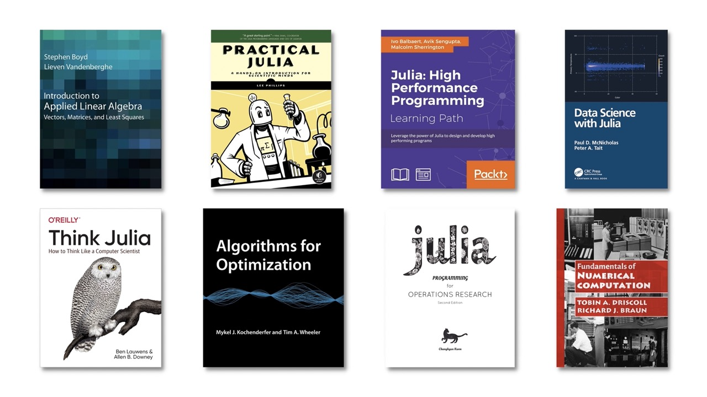
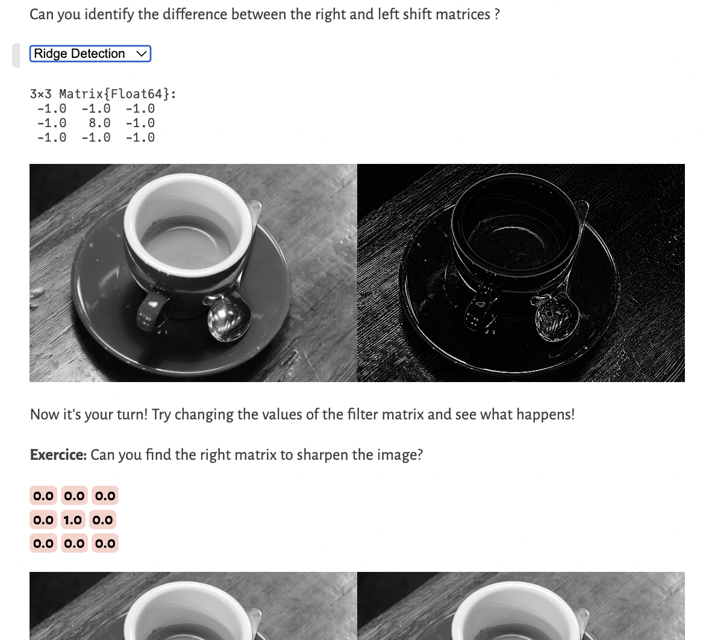
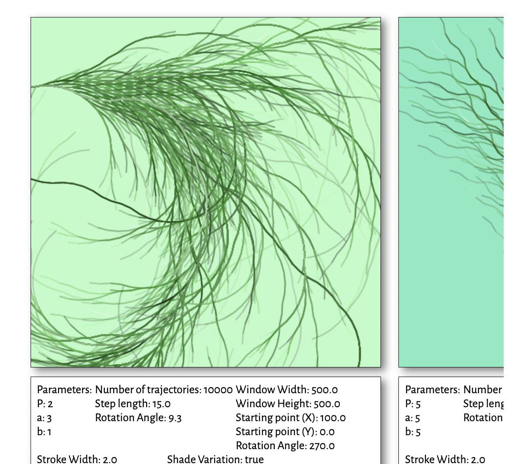
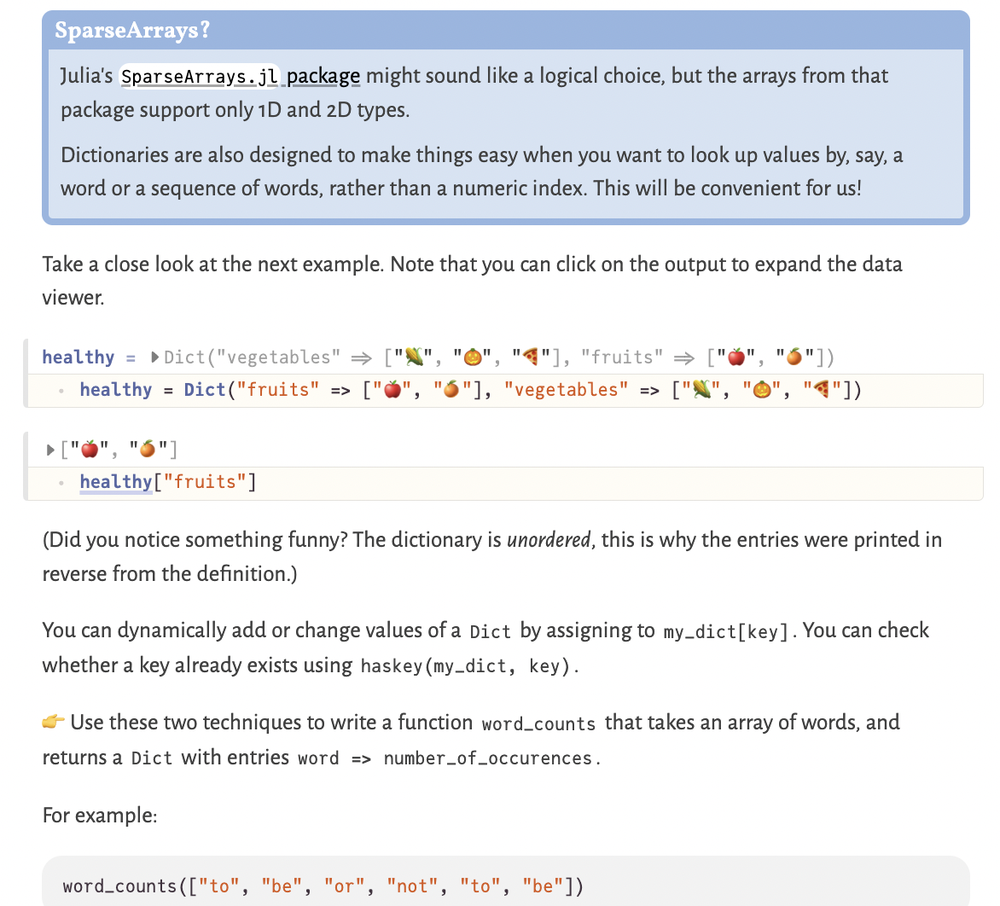

@def title="Get started with Julia"
@def hasmap = true

~~~
<!-- Get Started with Julia -->

  

    

    

      <h2 class="lead secondary-heading">Get Started with Julia</h2>
    

    

  

   
  

    

      <h3>Video Courses</h3>
      
Do you learn best by watching instructor led videos on programming? Check out the free <a href="https://www.youtube.com/user/JuliaLanguage/playlists">Julia video courses on YouTube</a>, prepared by core Julia developers and community members.

    

    

      <h3>Exercism Julia Track</h3>
      
Prefer to learn by doing exercises and getting feedback from a team of welcoming mentors? Check out the Julia Track on <a href="https://exercism.org/tracks/julia">Exercism.org</a>.

    

    

      <h3>The Manual</h3>
      
Want to just give it a shot and dive right into the Julia documentation? Check out the <a href="https://docs.julialang.org/en/v1/manual/getting-started/">getting started guide</a>.

    

  

<!-- Courses & Tutorials -->

    
  

    

      

      

        <h2 class="lead secondary-heading">Courses &amp; Tutorials</h2>
      

      

    

    <h3>Video Courses</h3>
    
A growing number of curated Julia courses are freely available on <a href="https://www.youtube.com/user/JuliaLanguage">YouTube</a>.

    <table class="table table-borderless">
      <tbody>
        <tr>
          <td><a href="https://www.youtube.com/playlist?list=PLP8iPy9hna6Qpx0MgGyElJ5qFlaIXYf1R">Julia for Nervous Beginners</a></td>
          <td>A course for people who are hesitant but curious about learning to write code in Julia. Taught by Dr Henri Laurie.</td>
        </tr>
        <tr>
          <td><a href="https://www.youtube.com/playlist?list=PLP8iPy9hna6QuDTt11Xxonnfal91JhqjO">Julia for Data Science</a></td>
          <td>From zero knowledge of Julia's Data Science capabilities to training models and performing analysis. Taught by Dr Huda Nassar.</td>
        </tr>
        <tr>
          <td><a href="https://www.youtube.com/playlist?list=PLP8iPy9hna6SGnG3FcHlYhdWWrZE7nNEx">Intro to DataFrames.jl</a></td>
          <td>In-memory tabular data in Julia using DataFrames.jl. Taught by Bogumi&#322; Kami&#324;ski.</td>
        </tr>
        <tr>
          <td><a href="https://www.youtube.com/playlist?list=PLP8iPy9hna6Q58n470P1oo7WX1fNZxneG">Computational Modeling (COVID-19)</a></td>
          <td>Computational modeling in Julia with applications to the COVID-19 pandemic. Taught by Alan Edelman &amp; David Sanders.</td>
        </tr>
        <tr>
          <td><a href="https://www.youtube.com/playlist?list=PLP8iPy9hna6QPqk4N8eBk0oXzLrLbOtTA">Decision Making Under Uncertainty</a></td>
          <td>Build and solve decision making problems using the POMDPs.jl ecosystem. Taught by Robert Moss.</td>
        </tr>
        <tr>
          <td><a href="https://www.youtube.com/playlist?list=PLP8iPy9hna6T56GkMHEdSrjCCheNuEwI0">Computational Thinking (MIT)</a></td>
          <td>MIT's open course 18.S191 on computational thinking using Julia, with interactive Pluto notebooks.</td>
        </tr>
      </tbody>
    </table>

    <h3>Written Tutorials</h3>
    
Community members have created a wide range of <a href="tutorials/">written tutorials</a> covering Julia from beginner to advanced levels. Once you're familiar with the language, <a href="https://modernjuliaworkflows.github.io/">ModernJuliaWorkflows</a> will teach you the secrets of productive Julia development.

  

    

<!-- Books -->

    
  

    

      

      

        <h2 class="lead secondary-heading">Books</h2>
      

      

    

     
    
Interested in getting a Julia book? Check out the <a href="books/">amazing books members of our community have written</a> since Julia was created.

    
  

    

<!-- Pluto.jl notebooks -->

    
  

    

      

      

        <h2 class="lead secondary-heading">Pluto.jl notebooks</h2>
      

      

    

    
<a href="https://plutojl.org/">Pluto.jl</a> is a Julia programming environment designed for <em>learning and teaching</em>, and it is a great way to get started with Julia programming, packages and visualisation.

    
Pluto.jl is <a href="https://plutojl.org/#install">easy to install</a>, and you can write interactive documents with no prior experience.

     
    

      

        
      

      

        
      

      

        
      

    

  

    

<!-- In the Classroom -->

    
  

    

      

      

        <h2 class="lead secondary-heading">In the Classroom</h2>
      

      

    

    
Julia is ready for the classroom. We encourage instructors to participate in the <a href="/community/">Julia community</a> for questions about Julia or specific packages. This page puts together various resources that instructors and students alike may find useful. See <a href="classes/">where Julia is being taught today</a>.

    

  

 
~~~
