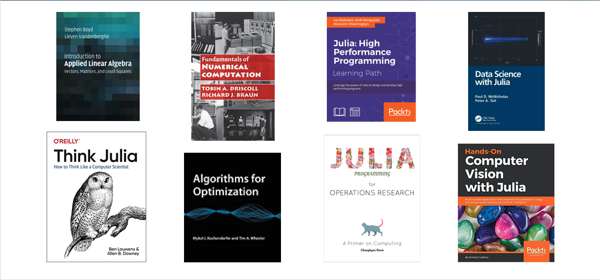
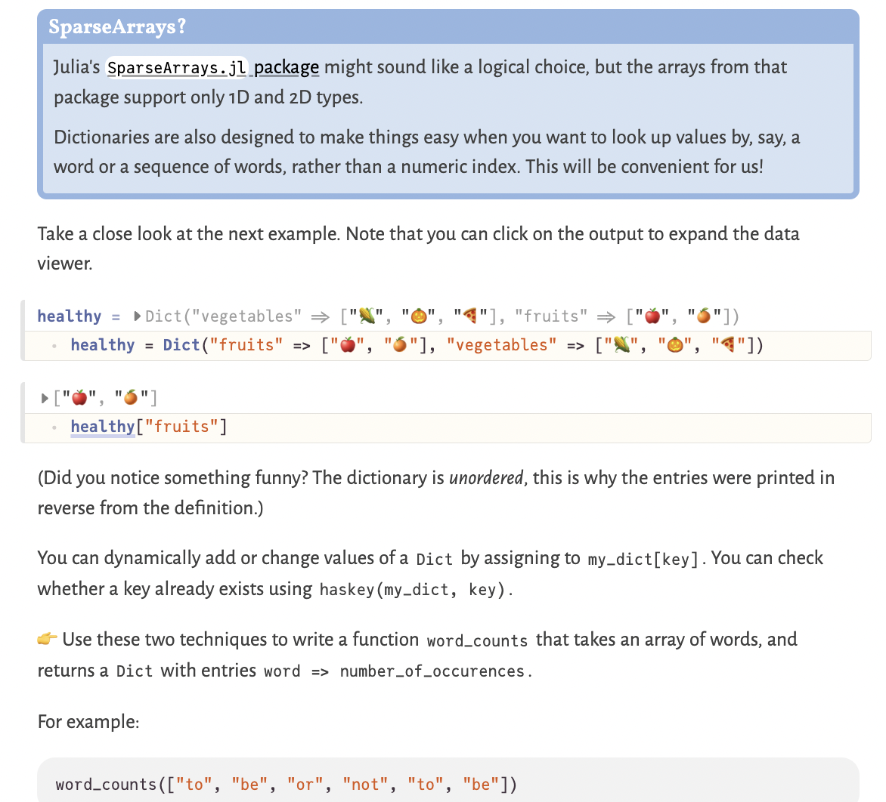

@def title="Get started with Julia"

~~~
<!--
      Containers: Get Started with Julia
 -->
 

   

     

     

       <h2 class="lead secondary-heading">
         Get Started with Julia
       </h2>
     

     

   

    

   

     <!-- 1 -->
     

       <h3>Julia Academy</h3>
       
Do you learn best by watching instructor led videos on programming? Check out
         <a href="https://juliaacademy.com/courses?preview=logged_out">JuliaAcademy</a> which was prepared by core Julia developers in collaboration with JuliaHub.
       

     

     <!-- 2 -->
     

       <h3>Exercism Julia Track</h3>
       
Prefer to learn by doing exercises and getting feedback from a team of welcoming mentors? Check out the Julia Track on <a href="https://exercism.org/tracks/julia">Exercism.org</a>.
       

     

     <!-- 3 -->
     

       <h3>The Manual</h3>
       
Want to just give it a shot and dive right into the Julia documentation? Check out the <a href="https://docs.julialang.org/en/v1/manual/getting-started/">getting started guide</a>.
       

     

   

<!--
      Containers: YouTube
 -->
 

     
   

     

     

       <h2 class="lead secondary-heading">
         YouTube
       </h2>
     

     

   

   

   <a href="https://www.youtube.com/user/JuliaLanguage/playlists">The Julia Language's YouTube</a> is the one stop shop for all things Julia on YouTube. From JuliaCon recordings to virtual meetups on technical topics, our YouTube channel hosts much of the existing community created Julia content. There are also a <a href="mooc/">few MOOC's</a> that have been created using Julia.
   

    
  

 <!--
      Containers: Julia Tutorials
 -->
  

     
   

     

       

       

         <h2 class="lead secondary-heading">Julia Tutorials</h2>
       

       

     

     
We have created a non-exhaustive list of community provided Julia tutorials. Check them out to <a href="tutorials/">learn Julia through the lens of someone from the community</a>. Once you're familiar with the language itself, the blog <a href="https://modernjuliaworkflows.github.io/">ModernJuliaWorkflows</a> will teach you the secrets of productive Julia development.
     

     
There also exist a growing number of curated Julia courses in the form of video lecture series. These courses are freely available on <a href="https://www.youtube.com/user/JuliaLanguage">YouTube</a>. You can also sign up through <a href="https://juliaacademy.com">JuliaAcademy</a> to track your progress, take quizzes, and get certificates.

     
   

 

 

<!--
    Containers: Julia Books
  -->

  

    
    

      

      

        <h2 class="lead secondary-heading">
          Books
        </h2>
      

      

    

     

    
Interested in getting a Julia book? Check out the <a href="books/">amazing books members of our community have written</a> since Julia was created.

    
  

    

 
 
 
<!--
     Containers: Pluto
-->

   
  

    

      

      

        <h2 class="lead secondary-heading">Pluto.jl notebooks</h2>
      

      

    

    
<a href="https://plutojl.org/">Pluto.jl</a> is a Julia programming environment designed for <em>learning and teaching</em>, and it is a great way to get started with Julia programming, packages and visualisation.

    
Pluto.jl is <a href="https://plutojl.org/#install">easy to install</a>, and you can write interactive documents with no prior experience.
    

     
     
    

      

        
      

      

        
      

      

        
      

    

  

 <!--
      Containers: Julia in the Classroom
 -->
 

    
   

     

       

       

         <h2 class="lead secondary-heading">In the Classroom</h2>
       

       

     

     
Julia is ready for the classroom. We encourage instructors to participate in the <a href="/community/">Julia community</a> for questions about Julia or specific packages.
     This page puts together various resources that instructors and students alike may find useful.
     See <a href="classes/">where Julia is being taught today</a>.
     

     
     <!-- You can find the editable classroom image here: https://docs.google.com/presentation/d/1t94qHV-Al8gr-AVGEB4RG1KPYMZEN0CUdlfV2oPsAgU/edit?usp=sharing Please ping community@julialang.org for access.  -->
   

 

 
~~~
